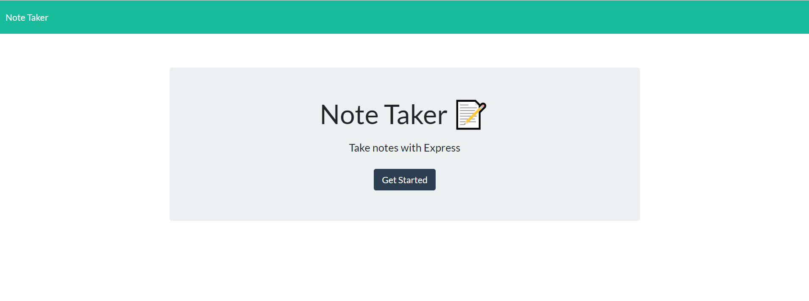
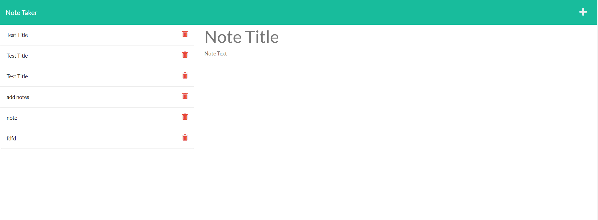

# Notes-Generator

## Description
This application creates a UI that allows you to create, save, and recall saved notes.  It uses routes to access the notes (/notes) and index (/*) pages.  You can use "api/notes" to access the notes database file.  When you save a note, you are updating the database file via a post request.

The deployed application can be found here: https://notes-generator1.herokuapp.com/

## Screenshots

